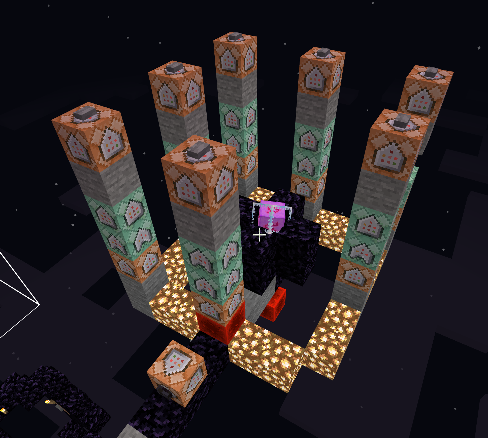

# Pegasus
## A commandblock driven teleporting space
----

### Overview

Split into two sections, a control area that is in a ticking area, and a vessel that remotely triggers the controls via its own command blocks.

Tracking of the sphere is done via an Entity (an ender_crystal) with a specific tag.

### Control tower



The control tower has 6 colums, one for each cardinal direction and and 2 for vertical ascension and descension.

Each control column has 3 blocks
1. Teleport the sphere
2. Teleport the entities inside the sphere
3. Reset the command colum


**North**  
North is negative on the Z index.
```
/execute @e[type=ender_crystal,tag=pegasus] ~~~ clone ~-4 ~-4 ~-4 ~+4 ~+4 ~+4 ~-4 ~-4 ~-20 masked move
/execute @e[type=ender_crystal,tag=pegasus] ~~~ tp @e[r=5] ~ ~ ~-16
/fill ~ ~-3 ~ ~ ~-3 ~ stone
```

**South**  
South is positive on the Z index.
```
/execute @e[type=ender_crystal,tag=pegasus] ~~~ clone ~-4 ~-4 ~-4 ~+4 ~+4 ~+4 ~-4 ~-4 ~+12 masked move
/execute @e[type=ender_crystal,tag=pegasus] ~~~ tp @e[r=5] ~ ~ ~+16
/fill ~ ~-3 ~ ~ ~-3 ~ stone
```

**West**  
West is negative on the X index.
```
/execute @e[type=ender_crystal,tag=pegasus] ~~~ clone ~-4 ~-4 ~-4 ~+4 ~+4 ~+4 ~-20 ~-4 ~-4 masked move
/execute @e[type=ender_crystal,tag=pegasus] ~~~ tp @e[r=5] ~-16 ~ ~
/fill ~ ~-3 ~ ~ ~-3 ~ stone
```

**East**  
East is positive on the X index.
```
/execute @e[type=ender_crystal,tag=pegasus] ~~~ clone ~-4 ~-4 ~-4 ~+4 ~+4 ~+4 ~+12 ~-4 ~-4 masked move
/execute @e[type=ender_crystal,tag=pegasus] ~~~ tp @e[r=5] ~+16 ~ ~
/fill ~ ~-3 ~ ~ ~-3 ~ stone
```

**Up**  
Up is positive on the Y index.
```
/execute @e[type=ender_crystal,tag=pegasus] ~~~ clone ~-4 ~-4 ~-4 ~+4 ~+4 ~+4 ~-4 ~+12 ~-4 masked move
/execute @e[type=ender_crystal,tag=pegasus] ~~~ tp @e[r=5] ~ ~+16 ~
/fill ~ ~-3 ~ ~ ~-3 ~ stone
```


**Down**  
Down is negative on the Y index.
```
/execute @e[type=ender_crystal,tag=pegasus] ~~~ clone ~-4 ~-4 ~-4 ~+4 ~+4 ~+4 ~-4 ~-20 ~-4 masked move
/execute @e[type=ender_crystal,tag=pegasus] ~~~ tp @e[r=5] ~ ~-16 ~
/fill ~ ~-3 ~ ~ ~-3 ~ stone 
```


## Triggering the controls

The control tower has an ender crystal in it encoded to the tag "anchor". The execution of the towers is all done relative to the anchor.


`/execute @e[type=ender_crystal,tag=anchor] ~ ~ ~ fill ~ ~ ~-3  ~ ~ ~-3 redstone_block` - north  
`/execute @e[type=ender_crystal,tag=anchor] ~ ~ ~ fill ~-3 ~ ~  ~-3 ~ ~ redstone_block` - west   
`/execute @e[type=ender_crystal,tag=anchor] ~ ~ ~ fill ~+3 ~ ~  ~+3 ~ ~ redstone_block` - east  
`/execute @e[type=ender_crystal,tag=anchor] ~ ~ ~ fill ~ ~ ~+3  ~ ~ ~+3 redstone_block` - south  
`/execute @e[type=ender_crystal,tag=anchor] ~ ~ ~ fill ~-3 ~ ~-3  ~-3 ~ ~-3 redstone_block` - down (NW)  
`/execute @e[type=ender_crystal,tag=anchor] ~ ~ ~ fill ~+3 ~ ~-3  ~+3 ~ ~-3 redstone_block` - up (NE)  
